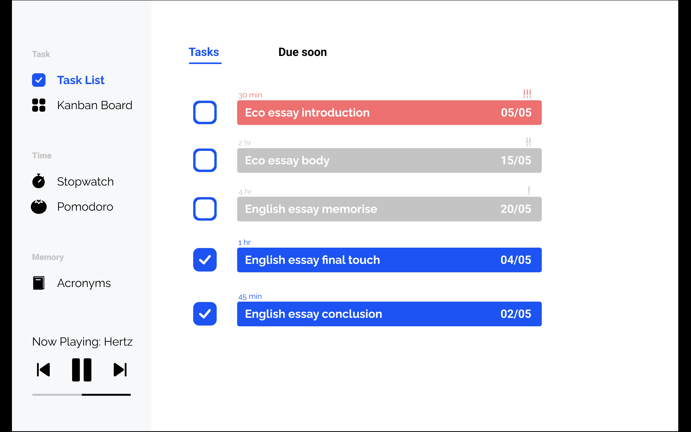
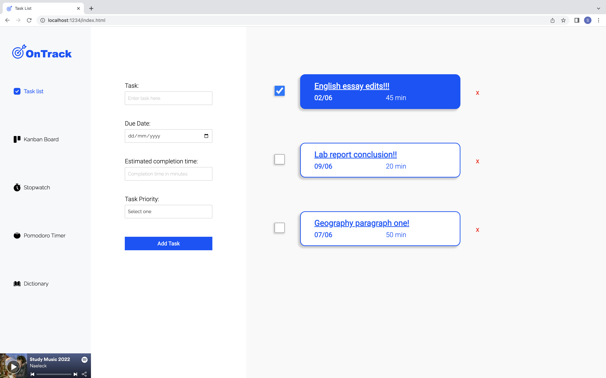
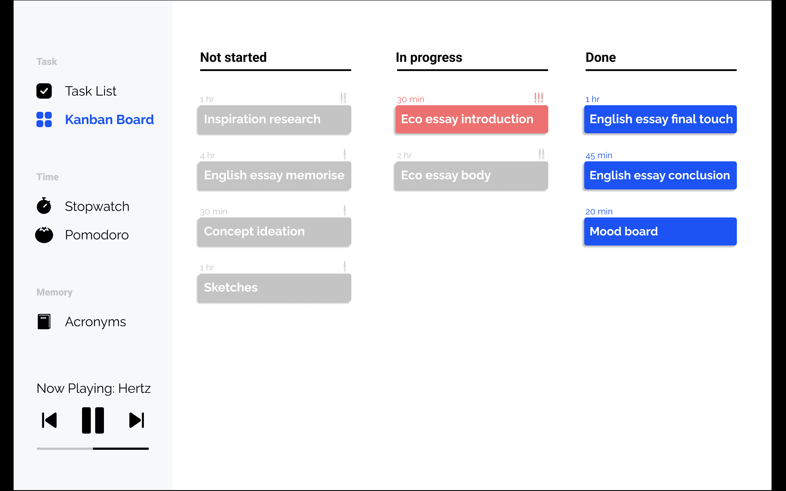
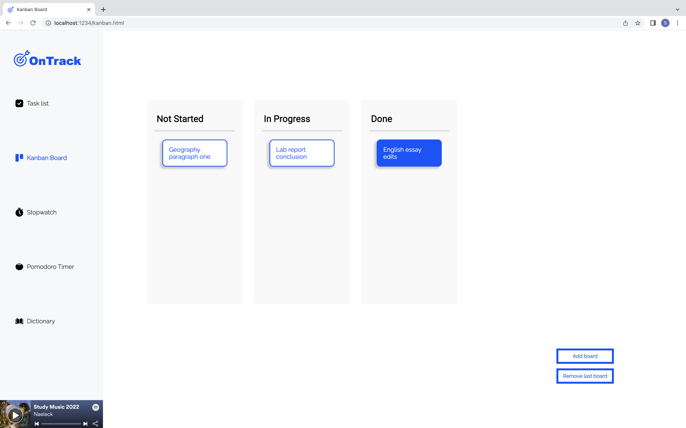
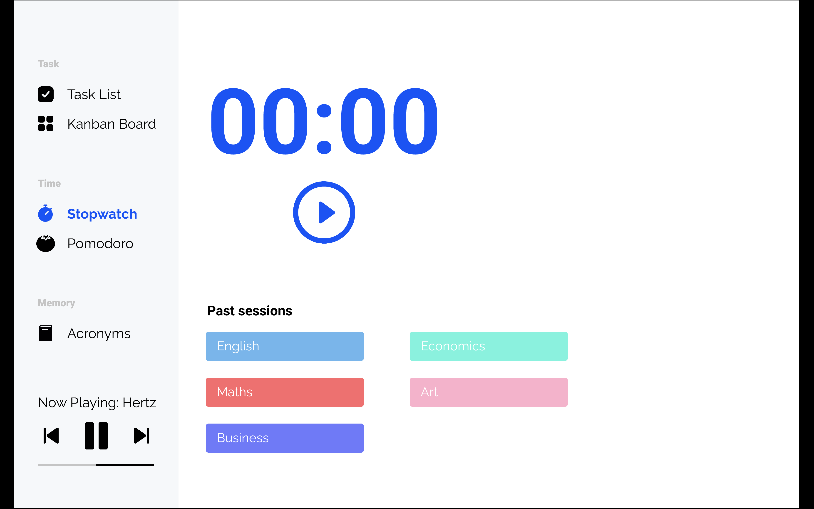
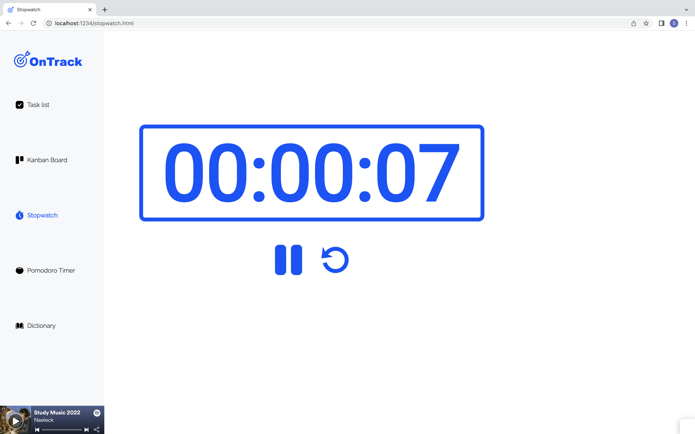
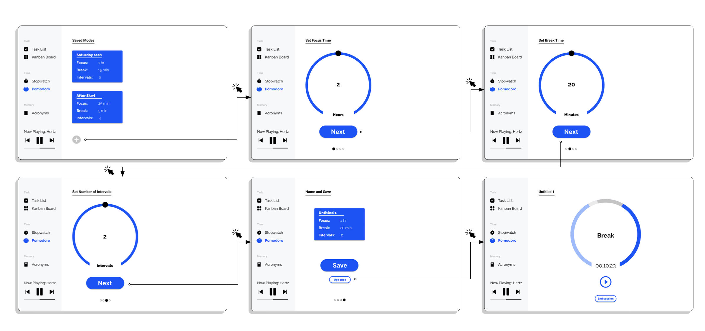
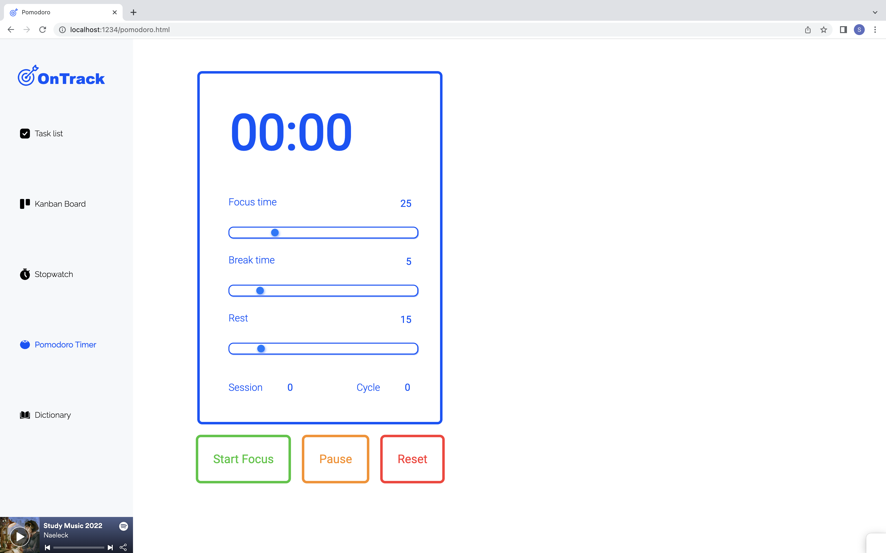
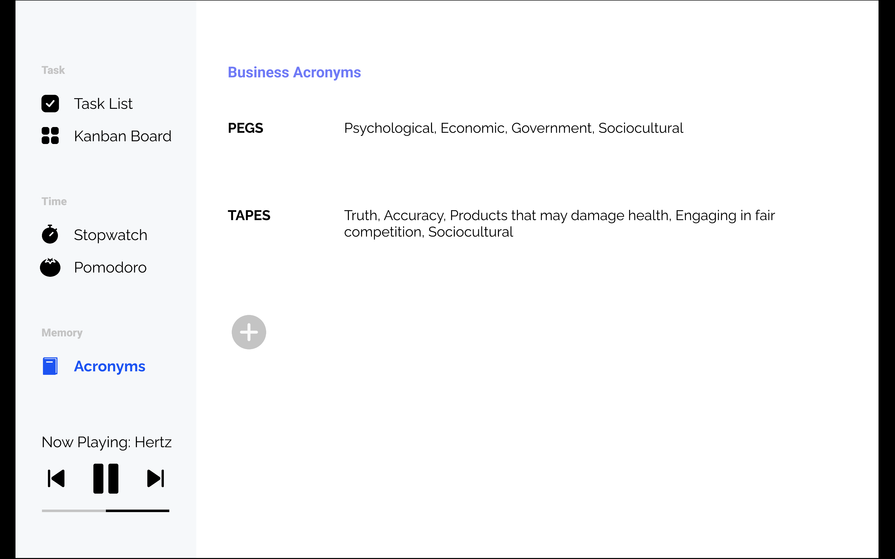
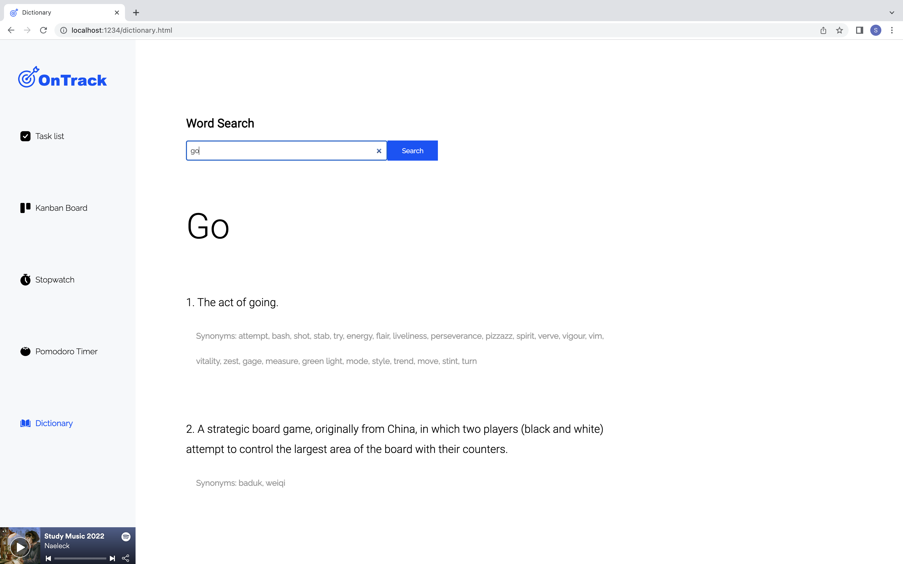

# On Track 

 This web application aims to help year 12 students manage their study sessions. 

## What's changed?
 This web application was originally designed in Figma. The design proposal was showed to year 12 students for feedback, before it was developed into a functional prototype. This README file will justify the major iterations made to the site, based on feedback from those year 12 students feedback, as well as further self reflection.

## Task List

 Figure 1: Task list proposal.

 

 Figure 2: Task list prototype.

 

 I presented a year 12 student with my proposal for my task list (figure 1) and they provided me with some feedback,

> "There's just too much going on, I don't know where to look" - ID: Year 12 student 1

 With consideration to Year 12 student 1's feedback, I developed an iteration of the task list page (figure 2). I made the information easier to disect by containing all the text within the borders. Furthermore, upon further self reflection, it was decided that the process of adding a task to the task list was too long. By displaying the task list form on the task list page, I have made the process of adding tasks more efficient and accessible.

## Kanban Board

 Figure 3: Kanban board proposal.

 

 Figure 4: Kanban board prototype.

 

 Before iterating the Kanban board, I considered existing kanban boards. I studied the Trello and Miro kanabn boards, as well as some kanban board's by designers on Dribble. I noticed that most of these boards used borders to distinguish between boards, which makes it easier for the user to differentiate between tasks in each board. For this reason, I have included borders in my iteration of the site, improving the readability of the kanban board. 

> "No, I don't fully get that, I thought it had something to do with the column it was in" - ID: Year 12 student 3

 Based on this feedback, it was understood that the red colour coding for priority tasks was not interpreted by users accurately. Therefore, the red colour coding was only creating unnecessary noise. For this reason, I have removed the red colour for priority tasks. However, year 12 students did understand that the blue fill colour represented that tasks had been completed. I kept this functionality in the prototype because of the positive user feedback it provides users when a task is complete.

> "I think I would add a number of boards, then only use that number of boards" - ID: Year 12 student 3

 Based on this feedback portraying how year 12 students would only add and remove board very occasionally, I placed the add and remove buttons in the bottom right of the screen, to reduce it's impact on the functionality of the kanban board.

 I also adjusted the overall style of the kanban board, so that the styling was more consistent with the rest of the site.

## Stopwatch

 Figure 5: Kanban board proposal.

 

 Figure 6: Kanban board prototype.

 

> "It's a cool idea, but I wouldn't use it" - ID: Year 12 student 2

 Based on this feedback, I decided to simplify the stopwatch page and just include the actual timing feature. I decided to provide space for the hours elapsed because upon further self reflection, it came to my attention that year 12 students sit over hour long exams and therefore need to time their practice exams for over an hour.

## Pomodoro

 Figure 7: Kanban board proposal.

 

 Figure 8: Kanban board prototype.

 

> "It looks confusing and it looks like there are a lot of steps" - ID: Year 12 student 1

 I originally proposed a pomodoro timer with a multi-page setup process. My iteration attempts to reduce this multi-page process down into one single page. Through user testing, it was found that this single-page process is quicker and more understandable. 

 With the new iteration, the user is unable to save their pomodoro time settings. The decision to make the setup process quicker and abandon the time saving functionality was made to increase the simplicity, minimalism and usability of the site. 

## Dictionary

 Figure 9: Acronyms proposal.

 

 Figure 10: Dictionary prototype.

 

> "I sometimes use acronyms, but I like to handwrite them" - ID: Year 12 student 1

> "A dictionary would be more useful" - ID: Year 12 student 2

 Further freedback from the year 12 students made it apparent that year 12 studnets like to handwrite their acronyms as it helps them remember the acronyms better. This created concerns for me as it indicated that year 12 students would not use a web application for acronyms.

 However, feedback also showed that the user group would benefit from a dictionary lookup, escpecially if the dictionary included synonyms as well as definitions. Therefore, the acronym maker was abandoned and replaced with a dictionary lookup.

## Future Development
 I would like to develop this prototype into a fully functional web application. The prototype still has some functionality aspects not working. For example, when the user refreshes the task list page and then deletes a task, that task is not deleted from local storage, so the task will still show in the kanban board or when the page is refreshed again. This, amongst other small functionality issues is what I would like to focus on fixing, if the prototype was to be further developed and used by year 12 students.

## References
Abhik b. (2021). Mini Javascript Project - Pomodoro Timer with Circular Progress Indicator (Vanilla JS , HTML ,CSS). YouTube. Retrieved from https://www.youtube.com/watch?v=MtYR2vCs2R0&t=643s 
CodeLab. (2018). HTML CSS JS - Speed Code - Stopwatch. YouTube. Retrieved from https://www.youtube.com/watch?v=yhhFXNHKpsk 
Free Dictionary API. (2022). Retrieved from https://dictionaryapi.dev/ 
Freepik. (2022) Icons. Flat Icon. Retrieved from https://www.flaticon.com/ 
Tartaglia, R. (2021) jKanban. Github. Retrieved from https://github.com/riktar/jkanban  
Naeleck. (2022) Study Music 2022. Spotify. Retrieved from https://open.spotify.com/playlist/471N195f5jAVs086lzYglw?si=bedb441cb53144b4 

